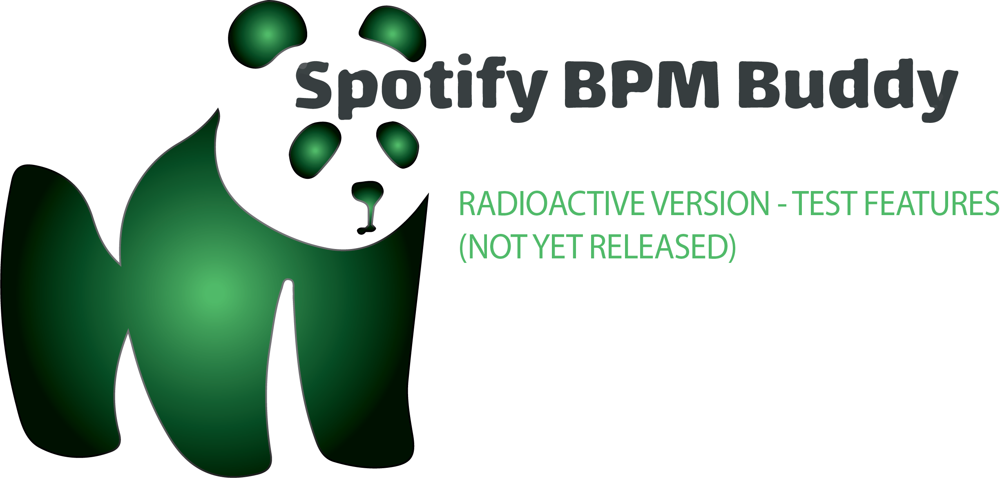

<a name="readme-top"></a>

<!-- PROJECT SHIELDS -->
<!--
*** I'm using markdown "reference style" links for readability.
*** Reference links are enclosed in brackets [ ] instead of parentheses ( ).
*** See the bottom of this document for the declaration of the reference variables
*** for contributors-url, forks-url, etc. This is an optional, concise syntax you may use.
*** https://www.markdownguide.org/basic-syntax/#reference-style-links
-->

[![Contributors][contributors-shield]][contributors-url]
[![Forks][forks-shield]][forks-url]
[![Stargazers][stars-shield]][stars-url]
[![Issues][issues-shield]][issues-url]
[![MIT License][license-shield]][license-url]
[![LinkedIn][linkedin-shield]][linkedin-url]

<!-- PROJECT LOGO -->
<br />
<div align="center">
  <a href="https://github.com/Shivamkak19/Spotify-BPMBuddy">
    
  </a>

<h3 align="center">Project Description</h3>

The Spotify BPM Buddy Chrome Extension is the perfect tool to bring your jam sessions and music practice sessions to the next level. The extension allows users to adjust the tempo of their Spotify player to a desired input tempo (non-commercial use only). The user simply provides an input tempo, and the player will adjust automatically. The metronome toggle makes it easy to overlay a metronome click onto any track at the adjusted tempo. The tool is great for practicing any instrument at a speed that is constructive to the user's individual needs and abilities. 

<br />

<a href="https://github.com/Shivamkak19/Spotify-BPMBuddy/images">View Product</a>
·
<a href="https://github.com/Shivamkak19/Spotify-BPMBuddy/issues">Report Bug</a>
·
<a href="https://github.com/Shivamkak19/Spotify-BPMBuddy/issues">Request Feature</a>
</div>


<!-- TABLE OF CONTENTS -->
<details>
  <summary>Table of Contents</summary>
  <ol>
    <li>
      <a href="#about-the-project">About The Project</a>
      <ul>
        <li><a href="#built-with">Built With</a></li>
      </ul>
    </li>
    <li>
      <a href="#getting-started">Getting Started</a>
      <ul>
        <li><a href="#installation">Installation</a></li>
      </ul>
    </li>
    <li><a href="#usage">Usage</a></li>
    <li><a href="#roadmap">Roadmap</a></li>
    <li><a href="#contributing">Contributing</a></li>
    <li><a href="#beta-features">Beta Features</a></li>
    <li><a href="#license">License</a></li>
    <li><a href="#contact">Contact</a></li>
    <li><a href="#acknowledgments">Acknowledgments</a></li>
  </ol>
</details>

<!-- ABOUT THE PROJECT -->
## About the Project

<!-- ![Product][product4] -->

<!-- <p align="right">(<a href="#readme-top">back to top</a>)</p> -->

### Built With

* [![chrome][chrome]][chrome-url]
* [![spotify][spotify]][spotify-url]
* [![tonejs][tonejs]][tonejs-url]
* [![html][html]][html-url]
* [![css][css]][css-url]
* [![js][js]][js-url]
* [![json][json]][json-url]

<p align="right">(<a href="#readme-top">back to top</a>)</p>

<!-- GETTING STARTED -->
## Getting Started

* Below, I have included the set-up process for downloading and running this extension locally. 
* After cloning the repository, load unpacked at [chrome://extensions](chrome://extensions) for local test environment. 

<!-- To run this project, you must download the latest version of the npm package manager.

  ```sh
  npm install npm@latest -g
  ``` -->

### Installation

1. Clone the repo
   ```sh
   git clone https://github.com/Shivamkak19/Spotify-BPMBuddy.git
   ```

2. Install NPM packages
   ```sh
   npm install
   ```

<p align="right">(<a href="#readme-top">back to top</a>)</p>


<!-- USAGE EXAMPLES -->
## Usage

Upon visiting https://open.spotify.com/, users will automatically be redirected to authorize usage with their Spotify account. 

![Product][product2]

After reaching the Spotify web player, they will be able to access the Spotify BPMBuddy as an icon in the footer containing the Spotify player.

![Product][product1]

Users can use Spotify BPMBuddy on all of their favorite tracks to adjust track tempo and overlay a metronome click. The extension will likely not work as intended for podcasts.

<p align="right">(<a href="#readme-top">back to top</a>)</p>

<!-- ROADMAP -->
## Roadmap

- [ ] Set up chrome manifest file
  - [ ] Set domain matches to https://open.spotify.com/*
- [ ] Set up test environment at chrome://extensions/
- [ ] Utilize Spotify API to get tempo of current track
    - [ ] Authorize Spotify user ID and get access token
    - [ ] HTTP GET request every time new track plays
- [ ] Grab HTML video playback element upon DOM creation
    - [ ] Write algorithm to modify playback rate based on input BPM
- [ ] Utilize Tone.js to implement drumsticks metronome (4/4 preset only)
- [ ] Write algorithm to match metronome to closest upcoming beat in currently playing track on metronomeStart and metronomeEnd events

See the [open issues](https://github.com/Shivamkak19/Spotify-BPMBuddy/issues) for a full list of proposed features (and known issues).

<p align="right">(<a href="#readme-top">back to top</a>)</p>

<!-- CONTRIBUTING -->
## Contributing

If you have a suggestion that would make this better, please fork the repo and create a pull request. You can also simply open an issue with the tag "enhancement".
Don't forget to give the project a star! Thanks again!

1. Fork the Project
2. Create your Feature Branch (`git checkout -b feature/newFeature`)
3. Commit your Changes (`git commit -m 'Add some new feature to Spotify-BPMBuddy'`)
4. Push to the Branch (`git push origin feature/newFeature`)
5. Open a Pull Request

<p align="right">(<a href="#readme-top">back to top</a>)</p>


<!-- BETA FEATURES -->
## Beta Features

<div align="center">

  <a href="https://github.com/Shivamkak19/Spotify-BPMBuddy">
    
  </a>

  <h3 align="center">Beta Features</h3>

  Beta features currently in production include features for more advanced metronome overlays onto the Spotify player. Most notably, this includes the ability to overlay preset drum beats onto the Spotify track along with a metronome click. Available drum presets depend on the time signature of the currently playing track. These features are intended to optimize timekeeping habits for music students in a way that keeps learning fun.

  The expected release data for this set of features is approx. December 2023 - February 2024. 

  <p align="right">(<a href="#readme-top">back to top</a>)</p>

</div>

<!-- LICENSE -->
## License

Distributed under the MIT License. See `LICENSE.txt` for more information.


<!-- CONTACT -->
## Contact

* Shivam Kak: sk3686@princeton.edu
* Project Link: [https://github.com/Shivamkak19/Spotify-BPMBuddy](https://github.com/Shivamkak19/Spotify-BPMBuddy)


<!-- ACKNOWLEDGMENTS -->
## Acknowledgments

* []() freeCodeCamp, for great instructional content regarding creating a chrome extension start to finish, available here: https://www.youtube.com/watch?v=0n809nd4Zu4
* []() [Nikunj Tyagi](https://www.linkedin.com/in/nikunj-tyagi/), for advice on product design during early stages

<p align="right">(<a href="#readme-top">back to top</a>)</p>


<!-- MARKDOWN LINKS & IMAGES -->
<!-- https://www.markdownguide.org/basic-syntax/#reference-style-links -->
[contributors-shield]: https://img.shields.io/github/contributors/Shivamkak19/Spotify-BPMBuddy.svg?style=for-the-badge
[contributors-url]: https://github.com/Shivamkak19/Spotify-BPMBuddy/graphs/contributors
[forks-shield]: https://img.shields.io/github/forks/Shivamkak19/Spotify-BPMBuddy.svg?style=for-the-badge
[forks-url]: https://github.com/Shivamkak19/Spotify-BPMBuddy/network/members
[stars-shield]: https://img.shields.io/github/stars/Shivamkak19/Spotify-BPMBuddy.svg?style=for-the-badge
[stars-url]: https://github.com/Shivamkak19/Spotify-BPMBuddy/stargazers
[issues-shield]: https://img.shields.io/github/issues/Shivamkak19/Spotify-BPMBuddy.svg?style=for-the-badge
[issues-url]: https://github.com/Shivamkak19/Spotify-BPMBuddy/issues
[license-shield]: https://img.shields.io/github/license/Shivamkak19/Spotify-BPMBuddy.svg?style=for-the-badge
[license-url]: https://github.com/Shivamkak19/Spotify-BPMBuddy/blob/master/LICENSE
[linkedin-shield]: https://img.shields.io/badge/-LinkedIn-black.svg?style=for-the-badge&logo=linkedin&colorB=555
[linkedin-url]: https://linkedin.com/in/shivamkak


[product1]: images/product1.png
[product2]: images/product2.png
[product3]: images/product3.png

<!-- Programming Language Shields -->
[chrome]: https://img.shields.io/badge/Chrome-API-00427e?style=for-the-badge&logo=googlechrome&logoColor=61DAFB
[chrome-url]: https://developer.chrome.com/docs/extensions/

[spotify]: https://img.shields.io/badge/spotify-api-333333?style=for-the-badge&logo=spotify&logoColor=spotify&labelColor=000000
[spotify-url]: https://developer.spotify.com/documentation/web-api

[html]: https://img.shields.io/badge/HTML5-dc4a25?style=for-the-badge&logo=html5&logoColor=ffffff
[html-url]: https://developer.mozilla.org/en-US/docs/Glossary/HTML5

[css]: https://img.shields.io/badge/CSS3-2862ea?style=for-the-badge&logo=css3&logoColor=ffffff
[css-url]: https://developer.mozilla.org/en-US/docs/Web/CSS

[js]: https://img.shields.io/badge/JS-000000?style=for-the-badge&logo=javascript&logoColor=efd81c
[js-url]: https://developer.mozilla.org/en-US/docs/Web/JavaScript

[json]: https://img.shields.io/badge/JSON-919191?style=for-the-badge&logo=json&logoColor=333333
[json-url]: https://developer.mozilla.org/en-US/docs/Web/JavaScript/Reference/Global_Objects/JSON

[tonejs-url]: https://tonejs.github.io/
[tonejs]: https://tinyurl.com/nhzmp7wt
[tonejs-original]: https://img.shields.io/badge/Tone-JS-f432d4.svg?style=for-the-badge&logo=data:image/svg+xml;base64,PHN2ZyB2ZXJzaW9uPSIxLjEiIGlkPSJMYXllcl8xIiB4bWxucz0iaHR0cDovL3d3dy53My5vcmcvMjAwMC9zdmciIHhtbG5zOnhsaW5rPSJodHRwOi8vd3d3LnczLm9yZy8xOTk5L3hsaW5rIiB4PSIwcHgiIHk9IjBweCIKCSB3aWR0aD0iMTAwJSIgdmlld0JveD0iMCAwIDI4MCAyODAiIGVuYWJsZS1iYWNrZ3JvdW5kPSJuZXcgMCAwIDI4MCAyODAiIHhtbDpzcGFjZT0icHJlc2VydmUiPgo8cGF0aCBmaWxsPSIjRjMzMkQ0IiBvcGFjaXR5PSIxLjAwMDAwMCIgc3Ryb2tlPSJub25lIiAKCWQ9IgpNMS4wMDAwMDAsMTI4LjAwMDAwMCAKCUMxLjAwMDAwMCw4NS42OTk4MjEgMS4wMDAwMDAsNDMuMzk5NjM5IDEuMDAwMDAwLDEuMDQ5NzMwIAoJQzk0LjIyNzA2NiwxLjA0OTczMCAxODcuNDU0MTc4LDEuMDQ5NzMwIDI4MS4wMDAwMDAsMS4wNDk3MzAgCglDMjgxLjAwMDAwMCw1MS4zNTM3NzkgMjgxLjAwMDAwMCwxMDEuNzA4MjI5IDI4MC42MzY4NDEsMTUyLjQ5OTYwMyAKCUMyNTguODc4ODE1LDE2NC4wMjM1NjAgMjM3LjQ3Mzc4NSwxNzUuMDkxMDgwIDIxNi4wOTIzMDAsMTg2LjIwMzg4OCAKCUMxOTkuNTcwNTExLDE5NC43OTA4OTQgMTgzLjA5NDgzMywyMDMuNDY2NjQ0IDE2Ni41NjU3MjAsMjEyLjAzOTM5OCAKCUMxNTguNTE0MDM4LDIxNi4yMTUzNjMgMTUwLjM4NzA1NCwyMjAuMjQ2MTQwIDE0MS4yODI3NDUsMjI0Ljg1NDU5OSAKCUMxNDAuNzQ1OTExLDE2OC41ODE5MDkgMTQwLjIxOTc1NywxMTMuNDI4NTUxIDEzOS42ODcyMTAsNTcuNjA2MzgwIAoJQzEzNy43ODk1NTEsNTguNDAxOTc4IDEzNi40MjE3NjgsNTguODY3NzAyIDEzNS4xNTIyNTIsNTkuNTIzNjcwIAoJQzExMi42OTQyOTAsNzEuMTI3ODYxIDkwLjIzNjc3MSw4Mi43MzMwNzAgNjcuODAzNDY3LDk0LjM4NDg0MiAKCUM1MC44NDIwODcsMTAzLjE5NDUxMSAzMy45NTM2NDQsMTEyLjE0NTUwMCAxNi45NDkyMDksMTIwLjg3MDgxOSAKCUMxMS43NzU1OTksMTIzLjUyNTQ5NyA2LjMyNDE4MiwxMjUuNjM4NzYzIDEuMDAwMDAwLDEyOC4wMDAwMDAgCnoiLz4KPHBhdGggZmlsbD0iIzIxREFCRSIgb3BhY2l0eT0iMS4wMDAwMDAiIHN0cm9rZT0ibm9uZSIgCglkPSIKTTEuMDAwMDAwLDEyOC40Njg2NTggCglDNi4zMjQxODIsMTI1LjYzODc2MyAxMS43NzU1OTksMTIzLjUyNTQ5NyAxNi45NDkyMDksMTIwLjg3MDgxOSAKCUMzMy45NTM2NDQsMTEyLjE0NTUwMCA1MC44NDIwODcsMTAzLjE5NDUxMSA2Ny44MDM0NjcsOTQuMzg0ODQyIAoJQzkwLjIzNjc3MSw4Mi43MzMwNzAgMTEyLjY5NDI5MCw3MS4xMjc4NjEgMTM1LjE1MjI1Miw1OS41MjM2NzAgCglDMTM2LjQyMTc2OCw1OC44Njc3MDIgMTM3Ljc4OTU1MSw1OC40MDE5NzggMTM5LjY4NzIxMCw1Ny42MDYzODAgCglDMTQwLjIxOTc1NywxMTMuNDI4NTUxIDE0MC43NDU5MTEsMTY4LjU4MTkwOSAxNDEuMjgyNzQ1LDIyNC44NTQ1OTkgCglDMTUwLjM4NzA1NCwyMjAuMjQ2MTQwIDE1OC41MTQwMzgsMjE2LjIxNTM2MyAxNjYuNTY1NzIwLDIxMi4wMzkzOTggCglDMTgzLjA5NDgzMywyMDMuNDY2NjQ0IDE5OS41NzA1MTEsMTk0Ljc5MDg5NCAyMTYuMDkyMzAwLDE4Ni4yMDM4ODggCglDMjM3LjQ3Mzc4NSwxNzUuMDkxMDgwIDI1OC44Nzg4MTUsMTY0LjAyMzU2MCAyODAuNjM2ODQxLDE1Mi45NjgyNjIgCglDMjgxLjAwMDAwMCwxOTUuNjMzMzc3IDI4MS4wMDAwMDAsMjM4LjI2Njc2OSAyODEuMDAwMDAwLDI4MC45NTAwNzMgCglDMTg3Ljc3Mjc4MSwyODAuOTUwMDczIDk0LjU0NTUzMiwyODAuOTUwMDczIDEuMDAwMDAwLDI4MC45NTAwNzMgCglDMS4wMDAwMDAsMjMwLjMxMjg4MSAxLjAwMDAwMCwxNzkuNjI1MTA3IDEuMDAwMDAwLDEyOC40Njg2NTggCnoiLz4KPC9zdmc+&labelColor=000000


